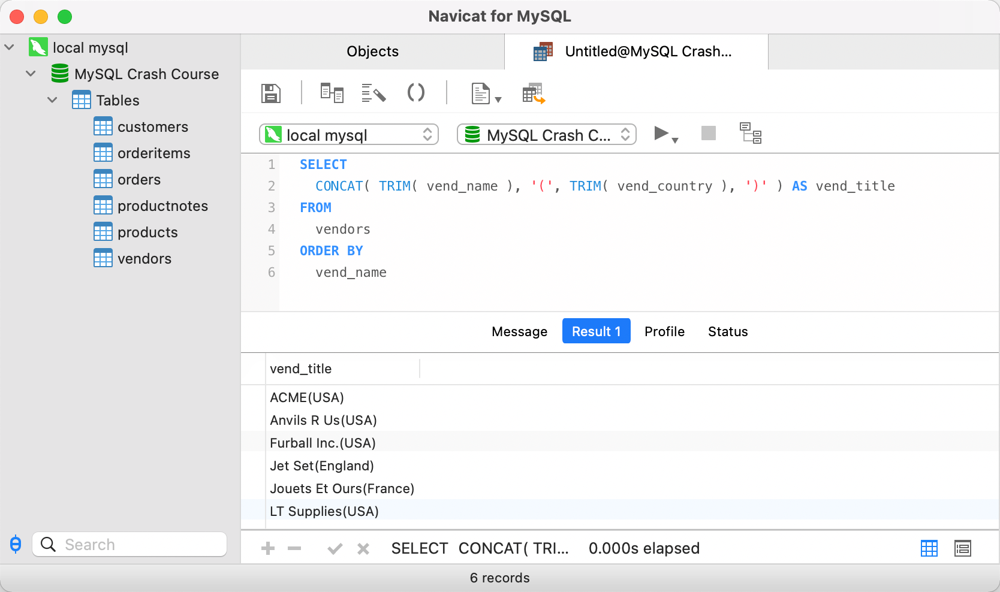
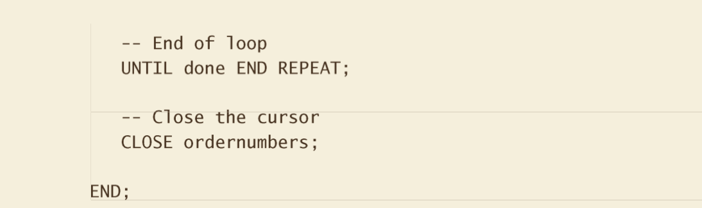
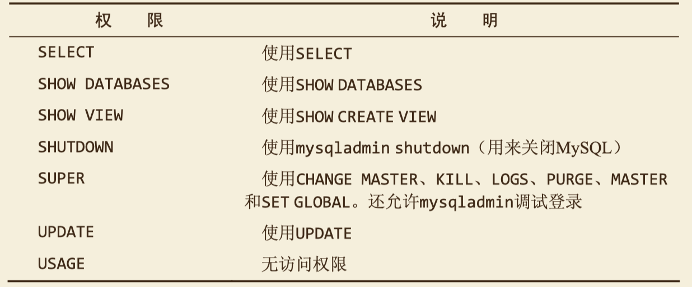

# mysql必知必会

## 第1章 了解SQl
### 数据库基础

数据库(DB)是保存有组织的数据的容器，我们并不是直接访问数据库，而是通过数据库管理系统(DBMS)创建和操作数据库。 

数据库包含若干张表(table)，每个表包含若干列(column),每个列有对应的数据类型。


表中的数据是按行存储的，所保存的每个记录存储在自己的行内。每一行都必须有可以唯一标识自己的一列（或一组列），将唯一标识表中每行的这个列（或这组列）称为主键。

> **主键的最好习惯** 除MySQL强制实施的规则外，应该坚持的 几个普遍认可的最好习惯为：
>
> - 不更新主键列中的值；
>
> - 不重用主键列的值；
>
> - 不在主键列中使用可能会更改的值
>
> **主键 vs 外键** 
>
> 一张表必须拥有一个且唯一的主键。
>
> 一张表可以有多个或零个外键，即关联其他表(==主表==)的字段，当其他表的数据变动时可能会影响到该表(==从表==)。
>
> 外键的作用，**==保持数据的一致性与完整性==**。是不允许改还是一起改，由事件触发器决定。
>
> SQL（发音为字母S-Q-L或sequel）是结构化查询语言（Structured Query Language）的缩写。SQL是一种专门用来与数据库通信的语言。

### sql的分类

- DDL：数据定义语言 create \ alter \ drop \ rename \ truncate

- DML：数据操作语言 insert \ delete \ update \ `select`

- DCL：数据控制语言 commit \ rollback \ savepoint \ grant \ revoke

## 第2章 MySQL简介

- MySQL是一种DBMS，即它是一种数据库软件。

- MySQL是开源软件，可以免费使用，甚至可以修改源码以定制化自己的需求。
- DBMS可分为两类：一类为基于共享文件系统的DBMS，另一类为基于客户机—服务器的DBMS。MySQL、Oracle以及Microsoft SQL Server等数据库是基于客户机—服务器的数据库。


## 第3章 使用MySQL 

### 链接

连接需要的信息：主机名、端口、用户、密码

### 选择数据库


### 了解数据库和表

> SHOW DATABASES; 返回可用数据库的一个列表。


> SHOW TABLES; 返回当前选择的数据库内可用表的列表


> SHOW COLUMNS 获取表中各个列的信息


> 其他SHOW语句：

- SHOW STATUS，用于显示广泛的服务器状态信息； 
- SHOW CREATE DATABASE 和 SHOW CREATE TABLE，分别用来显示创建特定数据库或表的MySQL语句；
- SHOW GRANTS，用来显示授予用户（所有用户或特定用户）的安全权限； 
- SHOW ERRORS 和 SHOW WARNINGS，用来显示服务器错误或警告消息。

## 第4章 检索数据

> ### 检索单个列


- 多条SQL语句必须以分号（;）分隔。MySQL 如同多数DBMS一样，不需要在单条SQL语句后加分号。

- SQL语句不区分大小写，但许多SQL开发人员喜欢对所有SQL关键字使用大写，而对所有 列和表名使用小写，这样做使代码更易于阅读和调试。
- 在处理SQL语句时，其中所有空格都被忽略。SQL语句可以在一行上给出，也可以分成许多行。多数SQL开发人员认为将SQL语句分成多行更容易阅读和调试。

> ### 检索多个列


> ### 检索所有列


> ### 检索不同的行


**📢注**：不能部分使用 DISTINCT。DISTINCT 关键字应用于所有列而不仅是前置它的列。如果给出 SELECT DISTINCT vend_id, prod_price，则 vend_id 和prod_price 组合在一起作为是否重复的判断标准。


> ### 限制结果


- LIMIT 5, 5指示MySQL返回从行5开始的5行。第一个数为开始位置，第二个数为要检索的行数。

- 检索出来的第一行为行0而不是行1。因此，LIMIT 5, 5 将检索出从第6行开始往后的5行数据。
- LIMIT 5 表示检索出最前面的5行数据，如果没有足够的行，则MySQL将只返回它能返回的那么多行。
- MySQL 5支持LIMIT的另一种替代语法。LIMIT 4 OFFSET 3 意为从行3开始取4行，就像LIMIT 3, 4一样。


> ### 使用完全限定的表名


📢注：在某些情况下，为了避免歧义，需要使用完全限定的表名。


## 第5章 排序检索数据

### 排序数据


> 通常，ORDER BY子句中使用的列将是为显示所选择的列。但是，实际上并不一定要这样，用非检索的列排序数据是完全合法的。
>

### 按多个列排序


> 多个列排序时，根据排序列的顺序进行排序。即上面的例子中，将先按prod_id进行升序排序(排序默认为升序ASC)，遇到相同的prod_id则根据prod_name进行升序排序。

### 指定排序方向


> - DESC则指定进行降序排列，上上述例子则表明先按prod_price进行降序排序，然后按照prod_name进行升序排序。
>
> - 在对文本性的数据进行排序时，A与a相同吗？a位于B之前还是位于Z之后？这些问题不是理论问题，其答案取决于数据库如何设置。A被视为与a相同，这是MySQL（和大多数数据库管理系统）的默认行为。但是，许多数据库管理员能够在需要时改变这种行为（如果你的数据库包含大量外语字符，可能必须这样做）。

## 第6章 过滤数据

> ==SQL执行顺序：==from...=> on => `where` ===> group by => having== => select => distinct => order by ==> limit

### where子句


### where子句操作符

| 操作符               | 说明                    |
| -------------------- | ----------------------- |
| =                    | 等于                    |
| <>                   | 不等于                  |
| !=                   | 不等于                  |
| <                    | 小于                    |
| <=                   | 小于等于                |
| >                    | 大于                    |
| >=                   | 大于等于                |
| BETWEEN  a  AND  b   | 在a,b值之间(包括边界[]) |
| IS NULL、IS NOT NULL | 空值检查                |


## 第7章 数据过滤

### 组合WHERE子句

#### AND操作


#### OR操作


> #### AND 优先级高于 OR，在复杂的过滤情况下，应该使用括号来体现优先级而不是利用其本身的优先级(因为后者容易混淆)。


#### IN 操作


> IN操作符用来指定条件范围，范围中的每个条件都可以进行匹配。

#### NOT 操作


> NOT是WHERE 子句中用来否定后跟条件的关键字


## 第8章 用通配符进行过滤

### 百分号（%）通配符


> - ‘jet%’ 将检索任意以jet起头的词，%告诉MySQL接受jet之后的任意字符，不管它有多少字符。 
>
> - 根据MySQL的配置方式，搜索可以是区分大小 写的。如果区分大小写，'jet%'与JetPack 1000将不匹配。


> - 搜索模式'%anv%'表示匹配任何位置包含文本anvil的值，而不论它之前或之后出现什么字符。
>
> - 尾空格可能会干扰通配符匹配。例如，在保存词anvil时 ， 如果它后面有一个或多个空格，则子句WHERE prod_name LIKE '%anvil'将不会匹配它们，因为在最后的l后有多余的字符。可以通过函数trim()进行空格的去除。


> 除了一个或多个字符外，%还能匹配0个字符。% 代表搜索模式中给定位置的0个、1个或多个字符。

### 下划线（_）通配符


> 与%能匹配0个字符不一样，_总是匹配一个字符，不能多也不能少

### 使用通配符的技巧

> - 不要过度使用通配符。如果其他操作符能达到相同的目的，应该使用其他操作符。
>
> - 在确实需要使用通配符时，除非绝对有必要，否则不要把它们用在搜索模式的开始处。把通配符置于搜索模式的开始处，搜索起来是最慢的。
>
> - 仔细注意通配符的位置。如果放错地方，可能不会返回想要的数据。


## 第9章 用正则表达式进行搜索

### 基本字符匹配

> like 匹配整个列，即精准匹配；regexp 可以匹配列中部分值，即模糊匹配。
>
> MySQL中的正则表达式匹配不区分大小写。为区分大小写，可使用 BINARY 关键字， 如 WHERE prod_name REGEXP BINARY 'JetPack .000'
>

```mysql
-- regexp 匹配'1000'
select prod_name from products where prod_name regexp '1000'
-- 返回 JetPack 1000

-- like 匹配'1000'
select prod_name from products where prod_name like '1000'
-- 不返回数据

-- .是正则表达式语言中一个特殊的字符。它表示匹配任意一个字符
select prod_name from products where prod_name regexp '.000'
-- 返回 JetPack 1000 、JetPack 2000
```

### 进行OR匹配

```mysql
-- |为正则表达式的OR操作符
select prod_name from products where prod_name regexp '1000|2000'
-- 返回 JetPack 1000、JetPack 2000
```

### 匹配几个字符之一

```mysql
-- [123]定义一组字符，匹配1或2或3
-- []是另一种形式的OR语句。事实上，正则表达式[123]Ton为[1|2|3]Ton的缩写。
select prod_name from products where prod_name regexp '[123] Ton'
-- 1 ton anvil、2 ton anvil
```

### 匹配范围

```mysql
-- [1-5]定义了一个范围，这个表达式意思是匹配1到5
select prod_name from products where prod_name regexp '[1-5] Ton'
-- 返回 .5 ton anvil、1 ton anvil、2 ton anvil
```

### 匹配特殊字符

> - 为了匹配反斜杠（\）字符本身，需要使用`\\\\`
>
> - 多数正则表达式实现使用单个反斜杠转义特殊字符，以便能使用这些字符本身。但MySQL要求两个反斜杠（MySQL 自己解释一个，正则表达式库解释另一个）
> - `\\`也用来引用元字符（具有特殊含义的字符）

```mysql
-- \\.匹配.，所以只检索出一行。这种处理就是所谓的转义（escaping），正则表达式内具有特殊意义的所有字符都必须以这种方式转义。这包括.、|、[]以及迄今为止使用过的其他特殊字符
select vend_name from venders where vend_name regexp '\\.'
-- 返回 Furball Inc.
```

| 空白元字符 | 说明     |
| ---------- | -------- |
| `\\`f      | 换页     |
| `\\`n      | 换行     |
| `\\`r      | 回车     |
| `\\`t      | 制表     |
| `\\`v      | 纵向制表 |

### 匹配字符类

> 存在找出你自己经常使用的数字、所有字母字符或所有数字字母字符等的匹配。 为更方便工作，可以使用预定义的字符集，称为字符类。

| 字符类     | 说明                                                        |
| ---------- | ----------------------------------------------------------- |
| [:alnum:]  | 任意字母和数字（同[a-zA-Z0-9]）                             |
| [:alpha:]  | 任意字符（同[a-zA-Z]）                                      |
| [:blank:]  | 空格和制表（同[`\\`t]）                                     |
| [:cntrl:]  | ASCII控制字符（ASCII 0到31和127）                           |
| [:digit:]  | 任意数字（同[0-9]）                                         |
| [:graph:]  | 与[:print:]相同，但不包括空格                               |
| [:lower:]  | 任意小写字母（同[a-z]）                                     |
| [:print:]  | 任意可打印字符                                              |
| [:punct:]  | 既不在[:alnum:]又不在[:cntrl:]中的任意字符                  |
| [:space:]  | 包括空格在内的任意空白字符（同[`\\`f`\\`n`\\`r`\\`t`\\`v]） |
| [:upper:]  | 任意大写字母（同[A-Z]）                                     |
| [:xdigit:] | 任意十六进制数字（同[a-fA-F0-9]）                           |

### 匹配多个实例

> 目前为止使用的所有正则表达式都试图匹配单次出现。如果存在一个匹配，该行被检索出来，如果不存在，检索不出任何行。但有时需要对匹配的数目进行更强的控制。

| 重复元字符 | 说明                         |
| ---------- | ---------------------------- |
| *          | 0个或多个匹配                |
| +          | 1个或多个匹配（等于{1,}）    |
| ？         | 0个或1个匹配（等于{0,1}）    |
| {n}        | 指定数目的匹配               |
| {n,}       | 不少于指定数目的匹配         |
| {n,m}      | 匹配数目的范围（m不超过255） |

```mysql 
-- \\(匹配(，[0-9]匹配任意数字（这个例子中为1和5），sticks?匹配stick和sticks（s后的?使s可选，因为?匹配它前面的任何字符的0次或1次出现），\\)匹配)。没有?，匹配stick和sticks会非常困难。
select prod_name from products 
where prod_name regexp '\\([0-9] sticks?\\)' 
order by prod_name
-- 返回 TNT (1 stick)、TNT (5 sticks)

--[:digit:]匹配任意数字，因而它为数字的一个集合。{4}确切地要求它前面的字符（任意数字）出现4次，所以 [[:digit:]]{4}匹配连在一起的任意4位数字
select prod_name from products 
where prod_name regexp '[:digit:]{4}' 
order by prod_name
-- 返回 JetPack 1000、JetPack 2000
```

### 定位符

> 目前为止的所有例子都是匹配一个串中==任意位置==的文本，为了匹配==特定位置==的文本，需要使用定位符。
>
> - ^有两种用法。在集合中（用[和]定义），用它来否定该集合，否则，用来指串的开始处。
> - LIKE和REGEXP的不同在于，LIKE匹配整个串而REGEXP匹配子串。利用定位符，通过用^开始每个表达式，用$结束每个表达式，可以使REGEXP的作用与LIKE一样。
> - 可以在不使用数据库表的情况下用 SELECT来测试正则表达式。REGEXP检查总是返回0（没有匹配）或1（匹配）。如：select 'hello' regexp '[0-9]'; =>显然，返回0。

| 定位元字符 | 说明                               |
| ---------- | ---------------------------------- |
| ^          | 文本的开始(小荷才露尖尖角^)        |
| $          | 文本的结尾(许愿池的硬币🪙沉入池底$) |
| [[:<:]]    | 词的开始                           |
| [[:>:]]    | 词的结尾                           |

```mysql
-- ^[0-9\\.]只在.或任意数字为串中第一个字符时才匹配它们。没有^，则还要多检索出4个别的行（那些中间有数字的行）
select prod_name from products 
where prod_name regexp '^[0-9]\\.' 
order by prod_name
-- 返回 .5 ton anvil、1 ton anvil、2 ton anvil
```


## 第10章 创建计算字段

### 拼接字段



> TRIM()函数去除串左右两边的空格，AS 创建字段的别名(alias)。

### 执行算术计算


> expanded_price 列为一个计算字段， 此计算为 quantity*item_price。
>
> MYSQL支持的基本算术操作符：+、-、*、/
>
> SELECT提供了测试和试验函数与计算的一个很好的办法,如SELECT 3*2;将返回6，SELECT Trim('abc');将返回abc，而SELECT Now()利用Now()函数返回当前日期和时间。通过这些例子，可以明白如何根据需要使用SELECT进行试验。


## 第11章 使用数据处理函数

### 文本处理函数

| 函数        | 说明                 |
| ----------- | -------------------- |
| Left()      | 返回串左边的字符     |
| Length()    | 返回串的长度         |
| Locate()    | 找出串的一个子串     |
| Lower()     | 将串转换为小写       |
| Trim()      | 去掉串左右两边的空格 |
| LTrim()     | 去掉串左边的空格     |
| Right()     | 返回串右边的字符     |
| RTrim()     | 去掉串右边的空格     |
| Soundex()   | 返回串的SOUNDEX值    |
| SubString() | 返回子串的字符       |
| upper()     | 将串转换为大写       |

> SOUNDEX是一个将任何文 本串转换为描述其语音表示的字母数字模式的算法。SOUNDEX考虑了类似的发音字符和音节，使得能对串进行发音比较而不是字母比较。虽然SOUNDEX 不是SQL概念，但MySQL（就像多数DBMS一样）都提供对SOUNDEX的支持。

### 日期和时间处理函数

| 函数                           | 说明                                             |
| ------------------------------ | ------------------------------------------------ |
| AddDate()                      | 增加一个日期（天、周等）                         |
| AddTime()                      | 增加一个时间（时、分等）                         |
| CurDate()                      | 返回当前日期                                     |
| CurTime()                      | 返回当前时间                                     |
| DateDiff()                     | 计算两个日期之差                                 |
| TimeStampdDiff()               | 计算两个时间之差                                 |
| Date_Add()                     | 高度灵活的日期运算函数                           |
| Date_Format()                  | 返回一个格式化的日期或时间串                     |
| Day()                          | 返回一个日期的天数部分                           |
| DayOfWeek()                    | 对于一个日期，返回对应的星期几                   |
| Hour()                         | 返回一个时间的小时部分                           |
| Minute()                       | 返回一个时间的分钟部分                           |
| Month()                        | 返回一个时间的月份部分                           |
| Now()                          | 返回当前日期和时间                               |
| Second()                       | 返回一个时间的秒部分                             |
| Time()                         | 返回一个日期时间的时间部分                       |
| Year()                         | 返回一个日期的年份部分                           |
| DATE_FORMAT(datetime,'%Y%m%d') | 返回格式化的日期，如'%Y%m%d'                     |
| LAST_DAY()                     | 返回给定日期当月的最后一天(可用于获取月份的天数) |

### 数值处理函数

| 函数   | 说明               |
| ------ | ------------------ |
| Abs()  | 返回一个数的绝对值 |
| Cos()  | 返回一个角度的余弦 |
| Exp()  | 返回一个数的指数值 |
| Mod()  | 返回除操作的余数   |
| Pi()   | 返回圆周率         |
| Rand() | 返回一个随机数     |
| Sin()  | 返回一个角度的正弦 |
| Sqrt() | 返回一个数的平方根 |
| Tan()  | 返回一个角度的正切 |


## 第12章 汇总数据

### 聚集函数

| 函数    | 说明             |
| ------- | ---------------- |
| AVG()   | 返回某列的平均值 |
| COUNT() | 返回某列的行数   |
| MAX()   | 返回某列的最大值 |
| MIN()   | 返回某列的最小值 |
| SUM()   | 返回某列值之和   |

> - AVG()、MAX()、MIN()、SUM()函数都忽略列值为NULL的行。
>
> - 如果指定列名，则指定列的值为空的行被COUNT()函数忽略，但如果COUNT()函数中用的是星号（*），则不忽略。

### 组合聚集函数


> 在指定别名以包含某个聚集函数的结果时，不应该使用表中实际的列名。虽然这样做并非不合法，但使用唯一的名字会使你的SQL更易于理解和使用（以及将来容易排除故障)。
>


## 第13章 分组数据

### 创建分组


> 使用了GROUP BY，就不必指定要计算和估值的每个组，系统会自动完成。GROUP BY子句指示MySQL分组数据，然后对每个组而不是整个结果集进行聚集。使用WITH ROLLUP 可以得到每个分组以及每个分组汇总级别（针对每个分组）的值。
>
> 与GROUP BY 相关的重要规定：
>
> - GROUP BY子句可以包含任意数目的列。这使得能对分组进行嵌套，为数据分组提供更细致的控制。 
>
> - 如果在GROUP BY子句中嵌套了分组，数据将在最后规定的分组上进行汇总。换句话说，在建立分组时，指定的所有列都一起计算 （所以不能从个别的列取回数据）。 
>
> - GROUP BY 子句中列出的每个列都必须是检索列或有效的表达式（但不能是聚集函数）。如果在 SELECT 中使用表达式，则必须在GROUP BY子句中指定相同的表达式。不能使用别名。
>
> - ==除聚集计算语句外，SELECT语句中的每个列都必须在GROUP BY子句中给出。==
>
> - ==如果分组列中具有NULL值，则NULL将作为一个分组返回。如果列中有多行NULL值，它们将分为一组。==
>
> - GROUP BY子句必须出现在WHERE子句之后，ORDER BY子句之前 

### 过滤分组


> HAVING 和 WHERE 的区别为，前者在数分组前进行过滤，后者在数据分组后进行过滤。==WHERE过滤行，HAVING过滤分组。==

### 分组和排序


> 一般在使用GROUP BY子句时，应该也给出ORDER BY子句。这是保证数据正确排序的唯一方法。千万不要仅依赖GROUP BY排序数据。

### SELECT子句顺序

> ==SQL执行顺序：==from...=> on => `where` ===> group by => having== => select => **distinct** => order by ==> limit


## 第14章 使用子查询

> 子查询：将一条SELECT语句的返回结果作为另一条SELECT语句的子句。
>
> 注意‼️：使用子查询并不总是执行这种类型的数据检索的最有效的方法。

### 利用子查询进行过滤


### 作为计算字段使用子查询


## 第15章 连结表

> 由没有联结条件的表关系返回的结果为笛卡儿积。即表中每一行分别与其他表的每一行进行联结。


## 第16章 创建高级链接

### 联结类型


> 自联结：表与自身进行联结。


> 自然联结(内联结)：表之间通过列中相同的值进行联结。(INNER) JOIN
>
> ON customer.cust_id = orders.cust_id 可以换成 **USING**(cust_id)


> 外联结：联结包含了那些在相关表中没有关联行的行。 OUTER JOIN
>
> ON customer.cust_id = orders.cust_id 可以换成 **USING**(cust_id)

### 使用带聚集函数的联结


## 第17章 组合查询

> 组合查询，即利用UNION操作符将多条SELECT语句组合成一个结果集。

需要使用组合查询的场景：

1、在单个查询中从不同的表返回类似结构的数据

2、对单个表执行多个查询，按单个查询返回数据


UNION规则：

- UNION必须由两条或两条以上的SELECT语句组成，语句之间用关键字UNION分隔（因此，如果组合4条SELECT语句，将要使用3个UNION关键字）

- UNION中的每个查询必须包含相同的列、表达式或聚集函数（不过各个列不需要以相同的次序列出）

- 列数据类型必须兼容：类型不必完全相同，但必须是DBMS可以隐含地转换的类型（例如，不同的数值类型或不同的日期类型）

  

**包含或取消重复的行**： UNION从查询结果集中自动去除了重复的行，UNION ALL则不取消重复了的行。

**对组合查询结果排序**：在用UNION组合查询时，只能使用一条ORDER BY子句，它必须出现在最后一条SELECT语句之后。对于结果集，不存在用一种方式排序一部分，而又用另一种方式排序另一部分的情况，因此不允许使用多条ORDER BY子句。


## 第18章 文本搜索

// ==TODO 实际生产中使用较少，后面进行补充==

> 对全文搜索的支持：MySQL两个最常使用的引擎为MyISAM和InnoDB，前者支持全文本搜索，而后者不支持。   

### 启用全文本搜索支持

```mysql

```

### 进行全文本搜索

```mysql

```

### 使用查询扩展

```mysql

```

### 布尔文本搜素

```mysql

```


## 第19章 插入数据

### 插入单行

```mysql
-- 方式一：依赖于表中列的定义次序
INSERT INTO TableName
VALUES(value1,value2,...valuen)

-- 方式二：因为提供了列名，VALUES必须以其指定的次序匹配指定的列名，不一定按各个列出现在实际表中的次序
INSERT INTO TableName（field1,field2,...,fieldn）
VALUES(value1,value2,...valuen)

REPLACE INTO 跟 INSERT INTO 功能类似，不同点在于：REPLACE INTO 首先尝试插入数据到表中，如果发现表中已经有此行数据（根据主键或者唯一索引判断）则先删除此行数据，然后插入新的数据;否则，直接插入新数据。
```

> 如果表的定义允许，则可以在INSERT操作中省略某些列。省略的列必须满足以下某个条件。
>
> - 该列定义为允许NULL值（无值或空值）。
>
> - 在表定义中给出默认值。这表示如果不给出值，将使用默认值。
>
>   
>
> 如果数据检索是最重要的（通常是这样），则你可以通过在INSERT 和 INTO 之间添加关键字 LOW_PRIORITY，指示MySQL降低INSERT语句的优先级，如：INSERT LOW_PRIORITY INTO 
>
> 注：UPDATE 和 DELETE 同样适用上述规则


### 插入多行

```mysql
INSERT INTO tableName（field1,field2,...,fieldn）
VALUES(value1,value2,...valuen);
INSERT INTO tableName（field1,field2,...,fieldn）
VALUES(value1,value2,...valuen)
```

> MySQL用单条INSERT语句处理多个插入比使用多条INSERT语句快，故单条语句插入多行可以提升性能。


### 插入检索出的数据

```mysql
INSERT INTO TableName（field1,field2,...,fieldn）
SELECT field1,field2,...,fieldn 
FROM TableName2
```

> 两个表的列名不一定要匹配，MySQL使用的是列的位置。


## 第20章 更新和删除数据

### 更新数据

```mysql
-- 更新单列
UPDATE tableName 
SET fieldn = valuen
WHERE 过滤条件

-- 更新多列
UPDATE tableName 
SET field1 = value1,...,fieldn = valuen
WHERE 过滤条件
```

> 如果用UPDATE语句更新多行，并且在更新这些行中的一行或多行时出一个现错误，则整个UPDATE操作被取消（错误发生前更新的所有行被恢复到它们原来的值）。为即使是发生错误，也继续进行更新，可使用IGNORE关键字，如下所示：
>
> UPDATE IGNORE customers …

### 删除数据

```mysql
DELETE FROM tableName
WHERE 过滤条件
```

> **DROP TABLE, TRUNCATE TABLE, DELETE TABLE　三种删除语句的区别**
>
> 1. DROP TABLE　==清除数据并且销毁表==，是一种**数据库定义语言**(DDL Data Definition Language), 执行后不能撤销，被删除表格的关系，索引，权限等等都会被永久删除。
> 2. TRUNCATE TABLE　只清除数据，保留表结构，列，权限，索引，视图，关系等等，相当于==清零数据==，是一种**数据库定义语言**(DDL Data Definition Language)，执行后不能撤销。
> 3. DELETE TABLE　删除（符合某些条件的）数据，是一种**数据操纵语言**(DML Data Manipulation Language)，执行后可以撤销。
>
> 运行速度一般DROP最快，DELETE最慢，但是DELETE最安全。


## 第21章 创建和操作表

### 创建表

```mysql
CREATE TABLE tableName(
	field1  类型  NULL / NOT NULL  (DEFAULT),
  field2  类型  NULL / NOT NULL  (DEFAULT), ...
  fieldn  类型  NULL / NOT NULL  (DEFAULT),
	PRIMARY KEY (fieldn)
)ENGINE = INNODB  
```

> MySQL包含的引擎：
>
> InnoDB是一个==可靠的事务处理引擎==，它不支持全文本搜索，目前为MySQL默认引擎；
>
> MyISAM是一个性能极高的引擎，它支持==全文本搜索==，但不支持事务处理。
>
> MEMORY在功能等同于MyISAM，但由于数据==存储在内存==（不是磁盘）中，速度很快（特别适合于临时表）；
>
> 注意：
>
> 引擎可以混用，即不同的表可以按照需求使用不同的引擎。但是混用引擎有一个极大的缺陷，即==外键==（用于强制实施引用完整性）==不能夸引擎==，即使用一 个引擎的表不能引用具有使用不同引擎的表的外键。

### 更新表

```mysql
-- 添加列
Alter table 表名 add column 列名 类型；（默认添加到表的最后一列）【first|after 字段名】可以指定位置
Eg：alter table employees add column full_name varchar after last_name;

-- 修改列名
Alter table 表名 change column 旧列名 新列名 类型；

-- 修改列的类型或约束
Alter table 表名 modify column 列名 新类型【新约束】；

-- 删除列
Alter table 表名 drop column 列名；

-- 修改表名
Alter table 表名 rename 【to】新表名；


-- 添加外键(即主动和一张表(主表)建立约束关系)
ALTER TABLE  tableName
ADD CONSTRAINT foreignKeyName FOREIGN KEY (fieldName)
REFERENCES 主表名 (fieldName)

-- 创建索引(普通索引/唯一索引、全文索引)
CREATE INDEX/unique index/fulltext index  indexName on tableName(fieldName) 

-- 删除索引
DROP index indexName on tableName
```

### 删除表

```mysql
DROP TABLE tableName
```

### 重命名表

```mysql
-- 重命名多张表
RENAME TABLE tableName1 TO newTableName1,
						 tableName2 TO newTableName2,...
						 tableNamen TO newTableNamen;	 
```


## 第22章 使用视图

> 使用视图的理由

- 重用SQL语句，简化复杂的SQL操作
- 使用表的组成部分而不是整个表
- 保护数据。可以给用户授予表的特定部分的访问权限而不是整个表的访问权限
- 更改数据格式和表示。视图可返回与底层表的表示和格式不同的数据


> 视图的规则和限制

- 视图是一张虚拟的表，包含了一个sql==查询==的结果
- 与表一样，视图必须唯一命名（不能给视图取与别的视图或表相同的名字）
- 对于可以创建的视图数目没有限制，创建视图需要足够的访问权限
- 视图可以嵌套。视图可以和表一起使用
- ORDER BY可以用在视图中，但如果从该视图检索数据SELECT中也含有ORDER BY，那么该视图中的ORDER BY将被覆盖
- 视图不能索引，也不能有关联的触发器或默认值


> 使用视图

- 视图用CREATE VIEW 语句来创建

- 使用SHOW CREATE VIEW viewname 来查看创建视图的语句。 

- 用DROP删除视图，其语法为 DROP VIEW viewname

- 更新视图时，可以先用DROP再用CREATE，也可以直接用CREATE OR REPLACE VIEW。如果要更新的视图不存在，则第2条更新语句会创建一个视图；如果要更新的视图存在，则第2条更新语句会替换原有视图。

> 如果MySQL不能正确地确定被更新的基数据，则不允许更新（包括插入和删除）。这实际上意味着，如果视图定义中有以下操作，则不能进行视图的更新：分组（使用GROUP BY和HAVING）、联结、子查询、并、聚集函数（Min()、Count()、Sum()等）、DISTINCT、导出（计算）列。
>
> 注意：一般将视图用于检索(SELECT)而不是更新(INSERT、UPDATE、DELETE)。


## 第23章 使用存储过程

存储过程就是为以后得使用而保存的一条或多条SQL语句的集合。

**执行存储过程**

```mysql
CALL procedureName(@出参,..,入参,...)     -- 所有mysql变量都必须以@开头
```


**创建存储过程**

```mysql
CREATE PROCEDURE procedureName(
  		OUT 变量名1 类型,
  		OUT 变量名1 类型,  ...
  		OUT 变量名n 类型
  		IN 变量名1 类型,
  		IN 变量名1 类型,  ...
  		IN 变量名n 类型
)
BEGIN
		若干sql语句
		selet ..
		INTO 变量名       
		from ...;
END；
```


**删除存储过程**

```mysql
DROP PROCEDURE procedureName;
```


**检查存储过程**

```mysql
SHOW CREATE PROCEDURE procedureName;

SHOW  PROCEDURE STATUS LIKE '';   -- 查看存储过程的详细信息
```


> 只有在存储过程内包含业务规则和智能处理时，它们的威力才真正显现出来。


## 第24章 使用游标

> 游标配合存储过程使用，在存储了游标后应用程序可以根据需要滚动或者浏览其中的数据。

### 创建游标

```mysql
-- 下面的语句定义了名为ordernumbers的游标，使用了可以检索所有订单的SELECT语句
-- 存储过程处理完成后，游标就消失(因为它局限于存储过程)
CREATE PROCEDURE processorders ( ) 
BEGIN
	-- 定义游标
	DECLARE ordernumbers CURSOR 
		FOR 
		SELECT order_num FROM orders;
		-- 打开游标
		OPEN ordernumbers;
		-- 关闭游标
		CLOSE ordernumbers;
END;
```

### 打开与关闭游标

```mysql
-- 打开游标
OPEN ordernumbers;

-- CLOSE释放游标使用的所有内部内存和资源，因此在每个游标 不再需要时都应该关闭。
CLOSE ordernumbers;
```

### 使用游标数据





## 第25章 使用触发器

触发器是MySQL响应以下任意语句而自动执行的一条MySQL语句（或位于 BEGIN 和 END 语句之间的一组语句）：INSERT、DELETE、UPDATE

### 创建触发器

```mysql
-- 创建触发器需要给出的信息
-- 1、唯一的触发器名，保证每个数据库的触发器名唯一
-- 2、触发器关联的表(只有表支持触发器，视图和临时表不支持)
-- 3、触发器应该响应的活动（DELETE、INSERT或UPDATE）
-- 4、触发器何时执行（处理之前或之后）
-- 注意：触发器按每个表每个事件定义，每个表每个事件每次只允许一个触发器。因此，每个表最多支持6个触发器（每条INSERT、UPDATE 和DELETE的之前和之后）
CREATE TRIGGER triggerName AFTER/BEFORE 响应的活动 ON tableName 触发器执行的动作(如 FOR EACH ROW SELECT '插入成功')
```

> 如果BEFORE触发器失败，则MySQL将不执行请 求的操作。此外，如果BEFORE触发器或语句本身失败，MySQL 将不执行AFTER触发器（如果有的话）

### 删除触发器

```mysql
DROP TRIGGER triggerName
```

### 使用触发器

```mysql
-- INSERT 触发器
-- 在 INSERT 触发器代码内，可引用一个名为 NEW 的虚拟表，访问被插入的行； 
-- 在 BEFORE INSERT 触发器中，NEW 中的值也可以被更新（允许更改被插入的值）； 
-- 对于 AUTO_INCREMENT 列，NEW 在 INSERT 执行之前包含0，在INSERT执行之后包含新的自动生成值。
-- 如下，对于orders的每次插入使用该触发器将总是返回新的订单号。
CREATE TRIGGER neworder AFTER INSERT ON orders
FOR EACH ROW SELECT NEW.order_num 
-- orders 表插入数据便会触发neworder触发器,返回此条数据的订单号
INSERT INTO orders(order_date,cust_id) VALUES(Now(),10001)

-- DELETE 删除触发器
-- 在DELETE触发器代码内，你可以引用一个名为OLD的虚拟表，访问被删除的行
-- OLD中的值全都是只读的，不能更新
-- 如下，orders表中数据删除前会触发deleteorder触发器，将数据插入archive_orders中
CREATE TRIGGER deleteorder BEFORE DELETE ON orders 
FOR EACH ROW 
BEGIN
	INSERT INTO archive_orders(order_num,order_date,cust_id)
  VALUES(OLD.order_num,OLD.irder_date,OLD.cust_id);
END

-- UPDATE 删除触发器
-- 在UPDATE触发器代码中，你可以引用一个名为OLD的虚拟表访问 以前（UPDATE语句前）的值，引用一个名为NEW的虚拟表访问新更新的值；
-- 在BEFORE UPDATE触发器中，NEW中的值可能也被更新（允许更改将要用于UPDATE语句中的值）
-- OLD中的值全都是只读的，不能更新。
-- 如下，updatevendor 保证vendor表中洲名缩写总是大写
CREATE TRIGGER updatevendor BEFORE UPDATE ON vendors
FOR EACH ROW SET NEW.vend_state = Upper(NEW.vend_state)
```

### 进一步认识触发器

> - 将BEFORE用于数据验证和净化，保证插入表中的数据确实是需要的数据。
> - 创建触发器可能需要特殊的安全访问权限，但是，触发器的执行是自动的。如果INSERT、UPDATE或DELETE语句能够执行，则相关的触发器也能执行。
> - 应该用触发器来保证数据的一致性（大小写、格式等）。在触发器中执行这种类型的处理的优点是它总是进行这种处理，而且是透明地进行，与客户机应用无关。
> - 触发器的一种非常有意义的使用是创建审计跟踪。使用触发器， 把更改（如果需要，甚至还有之前和之后的状态）记录到另一个表非常容易。
> - 遗憾的是，MySQL触发器中不支持CALL语句。这表示不能从触发器内调用存储过程。所需的存储过程代码需要复制到触发器内。


## 第26章 管理事务处理

> 事务处理是一种机制，用来管理必须成批执行的MySQL操作，以保证数据库不包含不完 整的操作结果。利用事务处理，可以保证一组操作不会中途停止，它们或者作为整体执行，或者完全不执行（除非明确指示）。如果没有错误发生，整组语句提交给（写到）数据库表。如果发生错误，则进行回退（撤销）以恢复数据库到某个已知且安全的状态。

> **事务处理相关的术语**

- 事务（transaction）指一组SQL语句；

- 回退（rollback）指撤销指定SQL语句的过程； 

- 提交（commit）指将未存储的SQL语句结果写入数据库表； 

- 保留点（ savepoint ）指事务处理中设置的临时占位符（placeholder），你可以对它发布回退（与回退整个事务处理不同）。


> 使用ROLLBACK

```mysql
select * from ordertotals;
start transaction;
delete from ordertotals;
select * from ordertotals;
-- ROLLBACK 语句回退 START TRANSACTION之后的所有语句，最后一条SELECT语句显示该表不为空。
-- ROLLBACK 只能在一个事务处理内使用，即在执行一条START TRANSACTION命令之后使用。
-- ROLLBACK 不能回退CREATE或DROP操作。
rollback;
select * from ordertotals;
```


> 使用COMMIT
>
> - 一般的MySQL语句都是直接针对数据库表执行和编写的。这就是所谓的隐含提交（implicit commit），即提交（写或保存）操作是自动进行的。但是，在事务处理块中，提交不会隐含地进行。为进行明确的提交， 需要使用COMMIT语句。
> - 当COMMIT或ROLLBACK语句执行后，事务会自动关闭（将来的更改会隐含提交）。
>

```mysql
start transaction;
delete from orderitems where order_num = 20010;
delete from orders where order_num = 20010;
commit;
```


> 使用保留点
>
> - 简单的ROLLBACK和COMMIT语句就可以写入或撤销整个事务处理。但是，只是对简单的事务处理才能这样做，更复杂的事务处理可能需要部分提交或回退。
> - 为了支持回退部分事务处理，必须能在事务处理块中合适的位置放置占位符。这样，如果需要回退，可以回退到某个占位符。这些占位符称为保留点。为了创建占位符，可如下使用SAVEPOINT 语句
>

```mysql
-- 创建保留点
savepoint delete1;

-- 回退到保留点,保留点在事务处理完成（执行一条ROLLBACK或 COMMIT）后自动释放
rollback delete1;
```


> 更改默认的提交行为
>
> mysql 默认为自动提交所有更改，可以通过设置autocommit为0(假)指示mysql不自动提交更改。

```mysql
set autocommit = 0;
```


## 第27章 全球化和本地化

> 字符集和校对顺序
>
> - 数据库表被用来存储和检索数据。不同的语言和字符集需要以不同的方式存储和检索。因此，MySQL需要适应不同的字符集（不同的字母和字符），适应不同的排序和检索数据的方法。
>
> - 使用何种字符集和校对的决定在服务器、数据库和表级进行

多语言和字符集相关术语：

- **字符集**为字母和符号的集合

- **编码**为某个字符集成员的内部表示

- **校对**为规定字符如何比较的指令


> 使用字符集和校对顺序


```mysql
-- 显示所有可用的字符集以及每个字符集的描述和默认校对
-- 很多字符集不止一种校对，而且许多校对出现两次，一次区分大小写（由_cs表 一次不区分大小写（由_ci表示）。
show character set;

-- 查看系统的字符集和校对
show variables like 'character%';
show variables like 'collation%';

-- 实际上，字符集很少是服务器范围（甚至数据库范围）的设置。不同的表，甚至不同的列都可能需要不同的字符集，而且两者都可以在创建表时指定。
create table mytable(
  column1 INT,
  column2 VARCHAR(10)
)default character set hebrew collate hebrew_general_ci;

-- MySQL还允许对每个列设置字符集和校对
create table mytable(
  column1 INT,
  column2 VARCHAR(10)
  column3 VARCHAR(10) character set latin1 collate latin1_general_ci
)default character set hebrew collate hebrew_general_ci;

-- 需要用与创建表时不同的校对顺序排序特定的SELECT语句，可以在SELECT语句自身中进行指定
-- COLLATE还可以用于GROUP BY、HAVING、聚集函数、别名等
select * from customers  
order by lastname,firstname collate latin1_general_cs;

```

> MySQL如下确定使用什么样的字符集和校对:
>
> - 如果指定CHARACTER SET和COLLATE两者，则使用这些值。
>
> - 如果只指定CHARACTER SET，则使用此字符集及其默认的校对（如SHOW CHARACTER SET的结果中所示）。
>
> - 如果既不指定CHARACTER SET，也不指定COLLATE，则使用数据库默认。
>
> 如果绝对需要，使用Cast()或Convert()函数在字符集之间进行转换。


## 第28章 安全管理

### 访问控制

> MySQL服务器的安全基础是：用户应该对他们需要的数据具有适当的访问权，既不能多也不能少。换句话说，用户不能对过多的数据具有过多的访问权。

访问控制的场景：

- 多数用户只需要对表进行读和写，但少数用户甚至需要能创建和删除表； 

- 某些用户需要读表，但可能不需要更新表；

- 你可能想允许用户添加数据，但不允许他们删除数据； 

- 某些用户（管理员）可能需要处理用户账号的权限，但多数用户不需要； 

- 你可能想让用户通过存储过程访问数据，但不允许他们直接访问数据； 

- 你可能想根据用户登录的地点限制对某些功能的访问。
- 不要使用root，应该严肃对待root登录的使用。仅在绝对需要时使用它（或许在你不能登录其他管理账号时使用）。不应该在日常的MySQL操作中使用root。


### 管理用户

> 创建用户账号

> - IDENTIFIED BY指定的口令为纯文本，MySQL 将在保存到user表之前对其进行加密。为了作为散列值指定口令，使用IDENTIFIED BY PASSWORD。
>
> - MySQL用来存储用户账号信息的表（以及表模式等）极为重要，对它们的任何毁坏都可能严重地伤害到MySQL服务器。因此，相对于直接处理来说，最好是用标记和函数来处理这些表

```mysql
-- mysql数据库有一个名为user的表，它包含所有用户账号
use mysql；
select user from user;

-- 创建用户和登录密码，GRANT语句也可以创建用户账号，但一般来说CREATE USER是最清楚和最简单的句子
create user jay identified by '1234';  

-- 更改用户名
rename user jay  to Jay;
```


> 删除用户账号

```mysql
drop user Jay;
```


> 设置访问权限

> GRANT和REVOKE可在几个层次上控制访问权限：
>
> - 整个服务器，使用GRANT ALL和REVOKE ALL 
>
> - 整个数据库，使用ON database.*
>
> - 特定的表，使用ON database.table 
>
> - 特定的列  
>
> - 特定的存储过程

```mysql
-- 查看赋予用户的权限
show grants for Jay;

-- 允许账号Jay在crashcourse数据库的所有表上使用select，拥有只读访问权限
grant select crashcourse.* to Jay;

-- 取消账号Jay在crashcourse数据库的所有表上使用select的权限
remove select crashcourse.* to Jay;

-- 批量授权
grant select, insert, update, delete on crashcourse.* to Jay;
```

**权限表**




> 更改密码

```mysql
-- 更改用户Jay的密码
set password for Jay = Password('12345');

-- 在不指定用户名时，SET PASSWORD更新当前登录用户的密码
set password = Password('@1234')
```


## 第29章 数据库维护

### 备份数据

> - 使用命令行实用程序mysqldump转储所有数据库内容到某个外部文件。在进行常规备份前这个实用程序应该正常运行，以便能正确地备份转储文件。  
>
> - 可用命令行实用程序 mysqlhotcopy 从一个数据库复制所有数据（并非所有数据库引擎都支持这个实用程序）。 
>
> - 可以使用MySQL的BACKUP TABLE或SELECT INTO OUTFILE转储所有数据到某个外部文件。这两条语句都接受将要创建的系统文件名，此系统文件必须不存在，否则会出错。数据可以用RESTORE TABLE来复原。
> - 为了保证所有数据被写到磁盘（包括索引数据）可能需要在进行备份前使用FLUSH TABLES语句。

### 进行数据库维护

> - ANALYZE TABLE，用来检查表键是否正确
>
> - CHECK TABLE用来针对许多问题对表进行检查。在MyISAM表上还对索引进行检查。CHECK TABLE支持一系列的用于MyISAM表的方式。 CHANGED检查自最后一次检查以来改动过的表。EXTENDED执行最彻底的检查，FAST只检查未正常关闭的表，MEDIUM检查所有被删 除的链接并进行键检验，QUICK只进行快速扫描。
> - 如果 MyISAM 表访问产生不正确和不一致的结果， 可能需要用 REPAIR TABLE来修复相应的表。这条语句不应该经常使用，如果需要经常使用，可能会有更大的问题要解决。
> - 如果从一个表中删除大量数据，应该使用OPTIMIZE TABLE来收回所用的空间，从而优化表的性能。

### 诊断启动问题

> 服务器启动问题通常在对MySQL配置或服务器本身进行更改时出现。MySQL在这个问题发生时报告错误，但由于多数MySQL服务器是作为系统进程或服务自动启动的，这些消息可能看不到。在排除系统启动问题时，首先应该尽量用手动启动服务器。MySQL 服务器自身通过在命令行上执行mysqld启动。下面是几个重要的mysqld 命令行选项：
>
> - --help显示帮助——一个选项列表 
>
> - --safe-mode装载减去某些最佳配置的服务器 
>
> - --verbose显示全文本消息（为获得更详细的帮助消息与--help联合使用） 
>
> - --version显示版本信息然后退出

### 查看日志文件

> MySQL维护管理员依赖的一系列日志文件。主要的日志文件有以下几种：
>
> - 错误日志。它包含启动和关闭问题以及任意关键错误的细节。此日志通常名为hostname.err，位于 data 目录中。此日志名可用--log-error命令行选项更改。
>
> - 查询日志。它记录所有MySQL活动，在诊断问题时非常有用。此日志文件可能会很快地变得非常大，因此不应该长期使用它。此日志通常名hostname.log， 位于 data 目录中。此名字可以用--log命令行选项更改。
>
> - 二进制日志。它记录更新过数据（或者可能更新过数据）的所有语句。此日志通常名为hostname-bin，位于data目录内。此名字可以用--log-bin命令行选项更改。注意，这个日志文件是MySQL5中添加的，以前的MySQL版本中使用的是更新日志。 
>
> - 缓慢查询日志。顾名思义，此日志记录执行缓慢的任何查询。这个日志在确定数据库何处需要优化很有用。此日志通常名为 hostname-slow.log，位于data 目录中。 此名字可以用 --log-slow-queries命令行选项更改。
>
> - 在使用日志时，可用FLUSH LOGS语句来刷新和重新开始所有日志文件。


## 第30章 改善性能

> 在诊断应用的滞缓现象和性能问题时，性能不良的数据库（以及数据库查询）通常是最常见的祸因。

**回顾各章重点，探讨数据库性能优化：**

- 首先，MySQL（与所有DBMS一样）具有特定的硬件建议。在学习和研究MySQL时，使用任何旧的计算机作为服务器都可以。但对用于生产的服务器来说，应该坚持遵循这些硬件建议。一般来说，关键的生产DBMS应该运行在自己的专用服务器上。

- MySQL是用一系列的默认设置预先配置的，从这些设置开始通常是很好的。但过一段时间后你可能需要调整内存分配、缓冲区大小等（为查看当前设置，可使用 SHOW VARIABLES; 和 SHOW STATUS;）

- MySQL是多用户多线程的DBMS，换言之，它经常同时执行多个任务。如果这些任务中的某一个执行缓慢，则所有请求都会执行缓慢。如果你遇到显著的性能不良，可使用SHOW PROCESSLIST 显示所有活动进程（以及它们的线程ID和执行时间）。你还可以用KILL命令终结某个特定的进程（使用此命令需要作为管理员登录）
- 总是有不止一种方法编写同一条SELECT语句。应该试验联结、并、子查询等，找出最佳的方法。

- 使用EXPLAIN语句让MySQL解释它将如何执行一条SELECT语句。

- 一般来说，存储过程执行得比一条一条地执行其中的各条MySQL语句快。

- 应该总是使用正确的数据类型。

- 决不要检索比需求还要多的数据。换言之，不要用SELECT *（除非你真正需要每个列）。

- 有的操作（包括INSERT）支持一个可选的DELAYED关键字，如果使用它，将把控制立即返回给调用程序，并且一旦有可能就实际执行该操作。  

- 在导入数据时，应该关闭自动提交。你可能还想删除索引（包括 FULLTEXT索引），然后在导入完成后再重建它们。

- 必须索引数据库表以改善数据检索的性能。确定索引什么不是一件微不足道的任务，需要分析使用的 SELECT 语句以找出重复的 WHERE和ORDER BY子句。如果一个简单的WHERE子句返回结果所花的时间太长，则可以断定其中使用的列（或几个列）就是需要索引的对象。

- 你的SELECT 语句中有一系列复杂的 OR 条件吗？通过使用多条 SELECT 语句和连接它们的 UNION 语句，你能看到极大的性能改进。

- 索引改善数据检索的性能，但损害数据插入、删除和更新的性能。如果你有一些表，它们收集数据且不经常被搜索，则在有必要之前不要索引它们（索引可根据需要添加和删除）  

- LIKE很慢。一般来说，最好是使用 FULLTEXT而不是LIKE。  

- 数据库是不断变化的实体。一组优化良好的表一会儿后可能就面目全非了。由于表的使用和内容的更改，理想的优化和配置也会改变。 

- 最重要的规则就是，每条规则在某些条件下都会被打破。


## 附录

> MySQL串数据类型

不管使用何种形式的串数据类型，串值都必须括在引号内（通常单引号更好）


> MySQL数值数据类型

- 所有数值数据类型（除BIT和BOOLEAN外）都可以有符号或无符号。有符号数值列可以存储正或负的数值，无符号数值列只能存储正数。默认情况为有符号，若不需要存储负值，则使用UNSIGNED关键字，可将存储范围拓宽两倍。

- MySQL中没有专门存储货币的数据类型，一般情况下使用DECIMAL(8, 2)


> MySQL日期和时间数据类型


> MySQL二进制数据类型

二进制数据类型可存储任何数据（甚至包括二进制信息），如图像、多媒体、字处理文档等。


